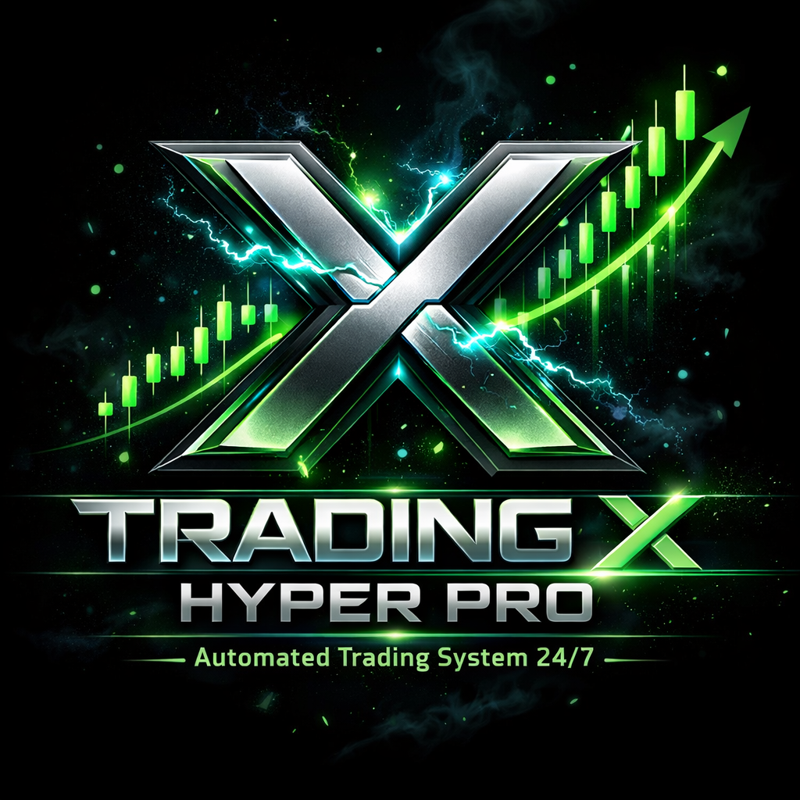

# 🚀 Trading X Hiper Pro  

Bot profesional de trading automático para **HyperLiquid PERP**, construido en **Python** y totalmente integrado con **Telegram**.

Este bot ejecuta operaciones automáticas 24/7 usando la estrategia **BlackCrow Aggressive**, optimizada para capturar movimientos fuertes del mercado.  
Incluye sistema de gestión de riesgo, *trailing stop*, *take profit* dinámico, módulo de referidos y motor de trading avanzado.

---

## 🔥 Características principales

### ✅ Trading automático 24/7
El bot analiza el mercado en tiempo real y ejecuta operaciones en pares PERP que utilicen **USDC**.

### 🎯 Estrategia BlackCrow Aggressive
- Señal de entrada basada en volatilidad + momentum  
- TP dinámico entre 3% y 6%  
- SL inteligente entre 1% y 1.5%  
- Trailing Stop opcional  

### ⚙ Gestión de riesgo avanzada
- Mínimo de operación: **5 USDC**
- Máximo **3 operaciones simultáneas**
- Soporte para apalancamiento x3 configurable

### 💼 Sistema de referidos
- Ganas el **5% del fee** generado por cada usuario que invites  
- El administrador recibe el **15%** del *profit* de cada operación

### 👑 Panel para el dueño
- Dashboard de ganancias acumuladas  
- Resumen de fees del bot  
- Monitoreo en tiempo real

---

## 📦 Estructura del proyecto
